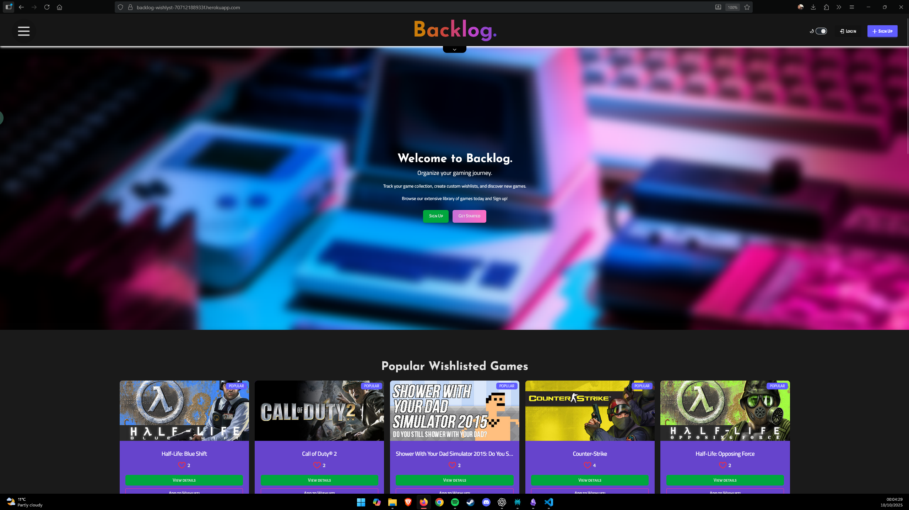
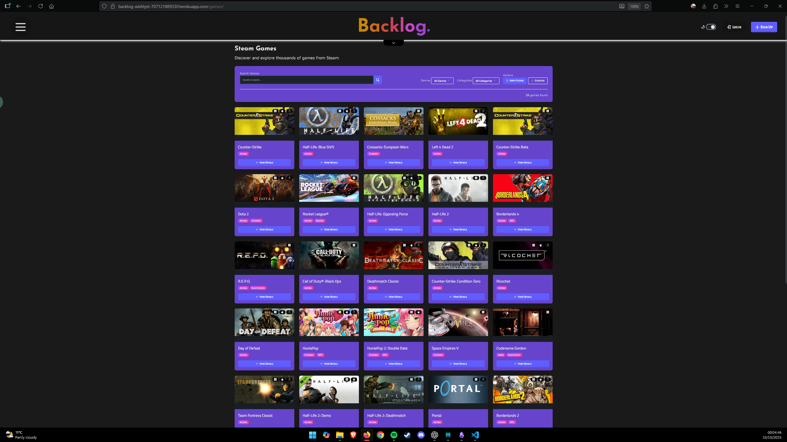
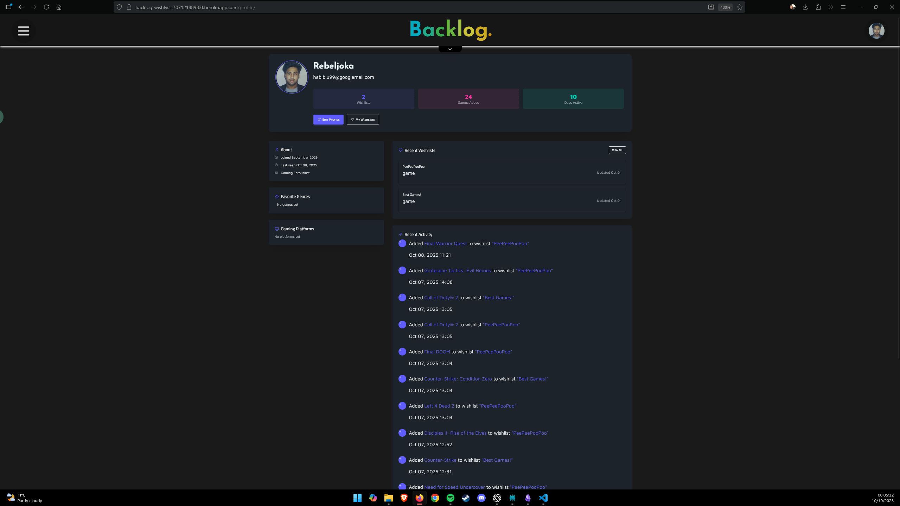
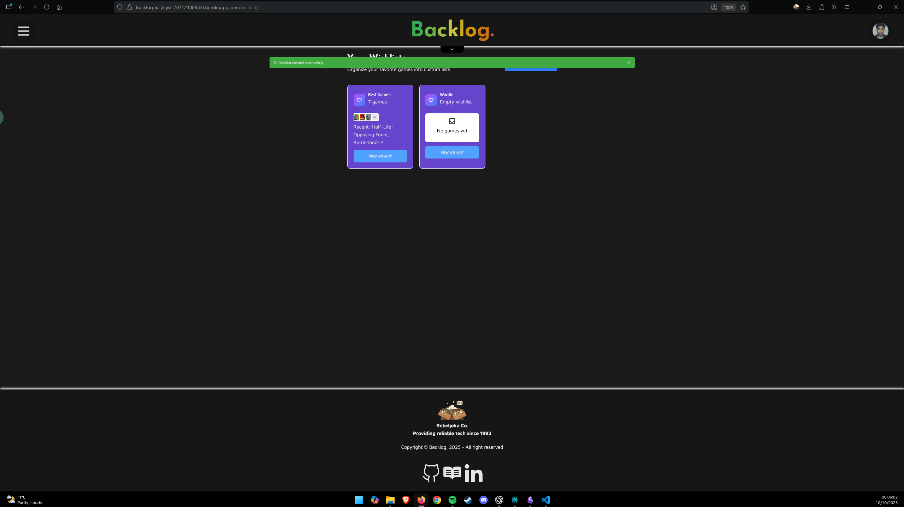

<p align="center">
   <a>
      
   </a>
</p>

<br>
<h1 align="center">Backlog.<br><br></h1>
<br><br>

<h1 align="center">Deployed Website</h1>

<p align="center">
   <a href="https://backlog-wishlyst-70712188933f.herokuapp.com/">
      
   </a>
</p>

<p align="center">Click the Logo above!</p>

<table border="4px" align="center">
   <thead>
      <tr>
         <th colspan="8" align="center">Technologies</th>
      </tr>
   </thead>
   <tbody>
   <tr>
      <th colspan="8" align="center" >Languages</th>
   </tr>
   <tr>
      <td colspan="2" align="center">
         
      </td>
      <td colspan="2" align="center">
         
      </td>
      <td colspan="2" align="center">
         
      </td>
      <td colspan="2" align="center">
        
      </td>
   </tr>
   <tr>
      <th colspan="8" align="center">Frameworks</th>
   </tr>
   <tr>
      <td colspan="2" align="center">
         
      </td>
      <td colspan="2" align="center">
         
      </td>
      <td colspan="2" align="center">
         
      </td>
      <td colspan="2" align="center">
         
      </td>
   </tr>
   <tr>
      <th colspan="8" align="center" >Libraries</th>
   </tr>
   <tr>
      <td colspan="2" align="center">
         
      </td>
      <td colspan="2" align="center">
         
      </td>
      <td colspan="2" align="center">
         
      </td>
      <td colspan="2" align="center">
         
      </td>
   </tr>
   <tr>
      <th colspan="8" align="center" >Programs</th>
   </tr>
   <tr>
      <td align="center">
         
      </td>
      <td align="center">
         
      </td>
      <td align="center">
         
      </td>
      <td align="center">
         
      </td>
      <td align="center">
         
      </td>
      <td align="center">
         
      </td>
      <td align="center">
         
      </td>
      <td align="center">
         
      </td>
   </tr>
   </tbody>
</table>

<details>
  <summary><strong>Table of Contents</strong></summary>

- [Introduction ](#introduction-)
  - [Discover Your Next Gaming Adventure – Where Every Wishlist Dream Comes True](#discover-your-next-gaming-adventure--where-every-wishlist-dream-comes-true)
  - [Never Miss Another Epic Release](#never-miss-another-epic-release)
  - [The Power of the Perfect Wishlist](#the-power-of-the-perfect-wishlist)
  - [More Than Just a List – It's Your Gaming DNA](#more-than-just-a-list--its-your-gaming-dna)
  - [Join the Community of Wishlist Warriors](#join-the-community-of-wishlist-warriors)
  - [Your Next Gaming Obsession is Just One Wishlist Away](#your-next-gaming-obsession-is-just-one-wishlist-away)
- [Responsivity ](#responsivity-)
- [Contents ](#contents-)
- [User Experience ](#user-experience-)
  - [User Stories](#user-stories)
  - [Strategy](#strategy)
  - [Scope](#scope)
  - [Skeleton](#skeleton)
  - [Structural](#structural)
  - [Surface](#surface)
- [UX Design ](#ux-design-)
  - [Typography](#typography)
  - [Color Scheme](#color-scheme)
  - [Imagery](#imagery)
- [Website Features ](#website-features-)
  - [Wishlist](#wishlist)
    - [Create Wishlists](#create-wishlists)
    - [Add Games to Wishlist](#add-games-to-wishlist)
    - [Reorder Games in Wishlist](#reorder-games-in-wishlist)
    - [Remove Games | Wishlist/s](#remove-games--wishlists)
  - [Profile](#profile)
    - [Real Time Tracking of Your Wishlists](#real-time-tracking-of-your-wishlists)
    - [Real Time Tracking of Games Added in Total](#real-time-tracking-of-games-added-in-total)
    - [Update Username, Email, First and Last Name](#update-username-email-first-and-last-name)
    - [Account Deletion](#account-deletion)
  - [Games Catalog](#games-catalog)
    - [View Games](#view-games)
    - [Search Suggestions](#search-suggestions)
    - [Genre Filtering](#genre-filtering)
    - [Category Filtering](#category-filtering)
- [Tablet | Mobile View ](#tablet--mobile-view-)
- [Future Features ](#future-features-)
- [Additional Technologies ](#additional-technologies-)
  - [Database](#database)
    - [Database Schema Documentation](#database-schema-documentation)
    - [Overview](#overview)
    - [**Core Entities**](#core-entities)
    - [USER](#user)
    - [GAME](#game)
    - [WISHLIST \& WISHLIST\_ITEM](#wishlist--wishlist_item)
    - [**Supporting Entities**](#supporting-entities)
    - [Classification System](#classification-system)
    - [User Experience Enhancement](#user-experience-enhancement)
    - [**Analytics**](#analytics)
    - [**Key Relationships \& Data Flow**](#key-relationships--data-flow)
    - [User-Centric Design](#user-centric-design)
    - [**Content Management**](#content-management)
    - [**Personalization Layer**](#personalization-layer)
    - [**Technical Implementation Notes**](#technical-implementation-notes)
    - [Database Design Patterns](#database-design-patterns)
    - [**Scalability Considerations**](#scalability-considerations)
- [Deployment \& Setup ](#deployment--setup-)
  - [Prerequisites](#prerequisites)
    - [Software Needed for Setup \& Deployment](#software-needed-for-setup--deployment)
  - [Deployment Steps](#deployment-steps)
    - [Clone Repository](#clone-repository)
    - [Heroku Deployment](#heroku-deployment)
    - [Cloudinary Setup](#cloudinary-setup)
    - [Connect Heroku to Github + Repository](#connect-heroku-to-github--repository)
    - [Finish](#finish)
- [Testing ](#testing-)
  - [Validation of  HTML, CSS, PYTHON](#validation-of--html-css-python)
  - [Lighthouse Audit Tests](#lighthouse-audit-tests)
  - [Manual Testing](#manual-testing)

</details>


  Bugs

 Credits
  Content References
   SteamAPI
   Icon/logo Generated by copilot
   steam games header image placeholder Generated by ChatGPT5
  Media References
  Acknowledgements
   Cohort Testing Support
   AI Development Assistance
    Code Generation + Completion
    Best Practices Implementation
    Testing & Quality Assurance
    Development Efficiency
     Reached MVP on day 3

<p align="center">&nbsp;</p>

## Introduction <br><br>

### Discover Your Next Gaming Adventure – Where Every Wishlist Dream Comes True

Welcome to the ultimate Steam game wishlist paradise! Gone are the days of frantically scrolling through endless game libraries or forgetting about that incredible indie gem you spotted months ago. Our platform transforms the chaotic world of Steam game discovery into your personal gaming treasure map.

### Never Miss Another Epic Release

Picture this: You're browsing Steam at 2 AM (we've all been there), you spot an amazing-looking game, add it to your wishlist, and then... it disappears into the digital void until you accidentally stumble upon it again months later. Sound familiar? That's where we come in! Our innovative wishlist system doesn't just store your games – it actively works to keep your gaming dreams alive.

### The Power of the Perfect Wishlist

Every time you add a game to your wishlist, you're not just bookmarking it – you're casting a vote for your future gaming happiness. Our platform harnesses this power by providing intelligent notifications when your wishlisted games hit sales, release demos, enter early access, or finally launch. We turn your wishlist from a forgotten digital drawer into a dynamic, living connection to your gaming future.

### More Than Just a List – It's Your Gaming DNA

Your wishlist tells a story about who you are as a gamer. Love atmospheric indie adventures? Crave heart-pounding multiplayer action? Our system learns from your choices and surfaces hidden gems that align perfectly with your gaming DNA. We don't just show you what's popular – we show you what's perfect for you.

### Join the Community of Wishlist Warriors

You're not alone in this journey. Connect with fellow gamers, discover what titles are generating buzz in the community, and get insider tips on upcoming releases that deserve a spot on your wishlist. Together, we're building the ultimate resource for Steam game discovery.

### Your Next Gaming Obsession is Just One Wishlist Away

Ready to transform how you discover, track, and experience Steam games? Your perfect gaming library is waiting to be curated, your next favorite game is waiting to be found, and your wishlist is about to become your most powerful gaming tool.

*Start building your ultimate Steam game wishlist today – because every great gaming adventure begins with a single wish.*

<p align="center">&nbsp;</p>

## Responsivity <br><br>

<table>
   <td>
      
      <sub><b>Figure 1.</b> Homepage Responsiveness</sub>
   </td>
   <td>
      
      <sub><b>Figure 2.</b> Games Catalog Responsivness</sub>
   </td>
</table>

<p align="center">&nbsp;</p>

## Contents <br><br>

<table>
   <td width="500">
      
      <sub><b>Figure 1.</b> Homepage</sub>
   </td>
   <td width="500">
      
      <sub><b>Figure 2.</b> Games Catalog</sub>
   </td>
</table>

<table>
   <td width="500">
      
      <sub><b>Figure 3.</b> Profile Page</sub>
   </td>
   <td width="500">
      
      <sub><b>Figure 4.</b> Wishlist Page</sub>
   </td>
</table>

<p align="center">&nbsp;</p>

## User Experience <br><br>
<p align="center">&nbsp;</p>

### User Stories

### Strategy

### Scope

### Skeleton

### Structural

### Surface

<p align="center">&nbsp;</p>

## UX Design <br><br>
<p align="center">&nbsp;</p>

### Typography

### Color Scheme

### Imagery

## Website Features <br><br>
<p align="center">&nbsp;</p>

### Wishlist
<p align="center">&nbsp;</p>

#### Create Wishlists

#### Add Games to Wishlist

#### Reorder Games in Wishlist

#### Remove Games | Wishlist/s

### Profile
<p align="center">&nbsp;</p>

#### Real Time Tracking of Your Wishlists

#### Real Time Tracking of Games Added in Total

#### Update Username, Email, First and Last Name

#### Account Deletion

### Games Catalog
<p align="center">&nbsp;</p>

#### View Games

#### Search Suggestions

#### Genre Filtering

#### Category Filtering

## Tablet | Mobile View <br><br>
<p align="center">&nbsp;</p>

## Future Features <br><br>
<p align="center">&nbsp;</p>

## Additional Technologies <br><br>
<p align="center">&nbsp;</p>

### Database

#### Database Schema Documentation

#### Overview
This Entity Relationship Diagram (ERD) represents the database structure for a Steam game wishlist management platform. The schema is designed to handle user authentication, game catalog management, personalized wishlists, user profiles, and activity tracking.

#### **Core Entities**

#### USER

- **Primary Entity**: Represents authenticated users in the system.
- **id (Primary Key)**: References Django's built-in authentication system.
- **username**: Unique identifier for user login.
- **Relationships**: Central hub connecting to games, wishlists, profiles, and activities.

#### GAME

- **Content Entity**: Stores comprehensive game information.
- **game_id (Primary Key)**: Unique game identifier.
- **submitted_by (Foreign Key)**: Links to the user who added the game.
- **Core Fields**: title, image, descriptions, release_date, developer, age_rating, platform.
- **Purpose**: Maintains the complete catalog of Steam games available for wishlisting.

#### WISHLIST & WISHLIST_ITEM
**Core Functionality**: Implements the wishlist system through a two-table approach.

- **WISHLIST**:
  - Container for user's wishlist collections.
  - Users can create multiple named wishlists.
  - Tracks creation and modification timestamps.

- **WISHLIST_ITEM**: Individual games within wishlists.
  - **order**: Enables custom ordering of games within lists.
  - **added_on**: Tracks when each game was wishlisted.
  - **Relationship**: Many-to-many between games and wishlists.

#### **Supporting Entities**
#### Classification System

- **TAG**: Flexible labeling system for games (e.g., "Indie", "Multiplayer", "Action").
- **GENRE**: Formal genre classification (e.g., "RPG", "Strategy", "Simulation").
- **PLATFORM**: Gaming platforms (Steam, Epic Games, etc.) with status tracking.

#### User Experience Enhancement

- **USER_PROFILE**:
  - Extended user information beyond basic authentication.
  - Profile customization (picture, bio).

- **FAVORITE_GENRE**: User's preferred game genres.
- **PLATFORM**: User's gaming platform preferences.

**ACTIVITY**:

- User action tracking for engagement and recommendations.
- Captures user interactions with timestamp and descriptive text.
- Icons for visual activity feed representation.

#### **Analytics**

**SITE_TRAFFIC_SNAPSHOT**:

- Daily analytics for platform monitoring.
- Distinguishes between unique and returning visitors.
- Enables growth tracking and usage pattern analysis.

#### **Key Relationships & Data Flow**

#### User-Centric Design

- USER → WISHLIST → WISHLIST_ITEM → GAME
  - Each user can create multiple wishlists, populate them with games in custom order, and manage their collections over time.

#### **Content Management**

- USER → GAME → (TAG/GENRE associations)
  - Users can contribute to the game catalog, with games being categorized through multiple classification systems.

#### **Personalization Layer**

- USER → USER_PROFILE → (FAVORITE_GENRE/PLATFORM preferences)
  - Rich user profiles enable personalized recommendations and improved user experience.

#### **Technical Implementation Notes**

#### Database Design Patterns

- **Foreign Key Relationships**: Maintain referential integrity across all entities.
- **Many-to-Many Associations**: Games can have multiple tags/genres; users can have multiple platform/genre preferences.
- **Timestamping**: Creation and modification tracking for wishlists, profiles, and activities.
- **Ordering Support**: Custom game ordering within wishlists via the order field.

#### **Scalability Considerations**

- **Separation of Concerns**: Distinct entities for different functional areas.
- **Flexible Categorization**: Multiple classification systems (tags, genres) for comprehensive game organization.
- **Activity Tracking**: Enables future features like recommendation engines and social features.
- **Analytics Ready**: Built-in traffic monitoring for platform optimization.

This schema provides a robust foundation for a comprehensive Steam game wishlist platform, supporting everything from basic wishlist functionality to advanced user personalization and platform analytics.

<p align="center">&nbsp;</p>

## Deployment & Setup <br><br>
<p align="center">&nbsp;</p>

### Prerequisites

#### Software Needed for Setup & Deployment
- A [Heroku](https://www.heroku.com/) Account is Required to Deploy your Application.
- [Git](https://git-scm.com/) For Cloning and Pushing to your Github Account.
- [Python 3.13.*](https://www.python.org/downloads/) Required for coding the Website.
- [Node,js](https://nodejs.org/en) Required to install packages from package.json for Setup.
- A [Cloudinary](https://cloudinary.com/) Account to Make Profile Feature Available
- PostgreSQL Database or Database of your choice

### Deployment Steps

#### Clone Repository

1. Open Visual Studio Code
2. Create a Bash Terminal in VS-Code
3. Change directory to where you wish for the Repository to be located using
   ``` cd .. or cd nameoffolder/ ```
4. Once prefered location is found and set type in the terminal ``` git clone https://github.com/Rebeljoka/Capstone-Project---Backlog.git ```.
5. Once all files are created, You need to create virtual environment by doing CTRL + SHFT + P and typing ``` Python: Create Environment ``` the repo requires python 3.13 so slecect that and call the Virtual Environment ``` venv ```.
6. Once venv is created, in your terminal write ``` .venv/Scripts/Activate ```
7. once activated you should type in the terminal in the .venv
   ```
   pip install -r requirements.txt
   pip freeze > requirements.txt
   ```
8. once completed, create a file in the root directory called
   ``` Procfile ```
      (This file is case sensitive and isnt allowed a file extension) in the procfile you want to add this line
   ``` web: gunicorn config.wsgi ```
9.  Next create another file in root directory called
   ``` env.py ``` and add this block of code into the file
   ```
      import os

      os.environ.setdefault(
         'SECRET_KEY',
         (
            'INSERT DJANGO SECRET KEY HERE'
         )
      )
      os.environ.setdefault(
         'DATABASE_URL',
         (
            'INSERT DATABASE URL HERE'
         )
      )
      os.environ.setdefault("DEBUG", "True")
      os.environ.setdefault('CLOUDINARY_CLOUD_NAME', 'INSERT CLOUDINARY NAME HERE')
      os.environ.setdefault('CLOUDINARY_API_KEY', 'INSERT CLOUDINARY API KEY HERE')
      os.environ.setdefault('CLOUDINARY_API_SECRET', 'INSERT API SECRET HERE')
   ```
(this file will be used for local deployment and testing)

10. Next apply migrations in the terminal using
   ```
   py manage.py makemigrations
   py manage.py migrate
   ```
   Next in the Terminal Type in
   ```
   py manage.py create superuser
   ```
11. Next create a new terminal in vscode and change directory using ```cd```
   ```
   cd theme/static_src
   ```
   and then type in 
   ```
   npm install
   ```
once that is done
   ```
   git add .
   git Commit -m "Add: Template"
   git Push
   ```
   this will push all the files to your local repository to github.

#### Heroku Deployment

1. Login to heroku
2. Create new app
3. New -> Create new app
4. Choose a unique app name, and select a region local to you, then click create app
5. Now We Have To Configure Environment Variables
6. go into the app you just created (if youre not in it already) and click the settings tab and scroll until you find reveal config vars and add the following keys:
   ```
   DISABLE_COLLECTSTATIC = 1
   DATABASE_URL = "" provide your postgreSQL DB URL/db of your choice
   SECRET_KEY = "" a secure random string of letters, numbers and characters.
   ```
 use a [secret key generator](https://djecrety.ir/) if needed (Use the same key and paste it in your env.py)

#### Cloudinary Setup

1. Sign Up/Login to Cloudinary
2. Go to Dashboard and find a tab called Product Environment and click go to API Keys
Click Generate New API Key, Confirm your email and give the API a nice name!
3. At the top of the site, cloudinary guides you on how to format your API key, for Heroku in config vars you Call the variable CLOUDINARY_URL and the value if everything after the =.
4. after adding cloudinary to heroku you need to add the API to env.py, once that is done push again to giithub and move on to next Section.

#### Connect Heroku to Github + Repository

1. In heroku go to deployment tab
2. Connect your app to your Github Repository
3. Click Deploy Branch to deploy your project to heroku
4. Once deployed, visit the link and copy it and paste the URL into Config/Settings.py ALLOWED_HOSTS so it looks like this (Replace the last one in the '*.70712188933f.herokuapp.com' with your link)
5. once all of that is done and you have pasted both the secret key in env and deployment link ALLOWED_HOSTS push to github again and deploy to heroku again and you should have a working site!


#### Finish
You now have your own wishlist website!

## Testing <br><br>
<p align="center">&nbsp;</p>

###  Validation of  HTML, CSS, PYTHON

### Lighthouse Audit Tests

### Manual Testing

<div align="center">

<table border="1px">
  <thead>
    <tr>
      <th align="center"></th>
      <th align="center">Each App Testing</th>
      <th align="center">Expected Results</th>
      <th align="center">Actual Results</th>
    </tr>
  </thead>
  <tbody>
    <!-- Visitor: 12 rows -->
    <tr>
      <td rowspan="10" align="center"><strong>Visitor</strong></td>
      <td align="center">Visitor can Navigate Homepage</td><td align="center">Pass</td><td align="center">Passed</td>
      </tr>
    <tr><td align="center">Visitor can browse games catalog and view details of individual games</td><td align="center">Pass</td><td align="center">Passed</td></tr>
    <tr><td align="center">Visitor can browse games catalog and view details of individual games</td><td align="center">Pass</td><td align="center">Passed</td></tr>
    <tr><td align="center">Visitor can Filter games/genres/categories using Filters</td><td align="center">Pass</td><td align="center">Passed</td></tr>
    <tr><td align="center">Visitor can use search bar on both Games catalog page and Nav Ba</td><td align="center">Pass</td><td align="center">Passed</td></tr>
    <tr><td align="center">Visitor Can Sign up to site</td><td align="center">Pass</td><td align="center">Passed</td></tr>
    <tr><td align="center">Visitor Cant view Wishlist without an account</td><td align="center">Pass</td><td align="center">Passed</td></tr>
    <tr><td align="center">Visitor Cant view Profile without an account</td><td align="center">Pass</td><td align="center">Passed</td></tr>
    <tr><td align="center">Visitor Cant Use Form on homepage without an account</td><td align="center">Pass</td><td align="center">Passed</td></tr>
    <tr><td align="center">Visitor Can set light/dark mode via Navbar</td><td align="center">Pass</td><td align="center">Passed</td></tr>
    <!-- User: 15 rows (starts immediately after Visitor) -->
    <tr>
      <td rowspan="15" align="center"><strong>User</strong></td>
      <td align="center">User can Navigate Homepage</td><td align="center">Pass</td><td align="center">Passed</td>
    </tr>
    <tr><td align="center">User can login</td><td align="center">Pass</td><td align="center">Passed</td></tr>
    <tr><td align="center">User can Suggest a game to be added using homepage form</td><td align="center">Pass</td><td align="center">Passed</td></tr>
    <tr><td align="center">User can Navigate to various Sections using Navbar</td><td align="center">Pass</td><td align="center">Passed</td></tr>
    <tr><td align="center">User can Browse games catalog and view details of individual games</td><td align="center">Pass</td><td align="center">Passed</td></tr>
    <tr><td align="center">User can Filter games/genres/categories using Filters</td><td align="center">Pass</td><td align="center">Passed</td></tr>
    <tr><td align="center">User can Use search bar on both Games catalog page and Nav Bar</td><td align="center">Pass</td><td align="center">Passed</td></tr>
    <tr><td align="center">User can Create 1 or more wishlist/s</td><td align="center">Pass</td><td align="center">Passed</td></tr>
    <tr><td align="center">User can View Each wishlist</td><td align="center">Pass</td><td align="center">Passed</td></tr>
    <tr><td align="center">User can Update/Order games on wishlist</td><td align="center">Pass</td><td align="center">Passed</td></tr>
    <tr><td align="center">User can Add/Remove Games on wishlist</td><td align="center">Pass</td><td align="center">Passed</td></tr>
    <tr><td align="center">User can Remove/Delete Wishlist</td><td align="center">Pass</td><td align="center">Passed</td></tr>
    <tr><td align="center">User can View Profile</td><td align="center">Pass</td><td align="center">Passed</td></tr>
    <tr><td align="center">User can Update Profile Picture, Name, Username, Password</td><td align="center">Pass</td><td align="center">Passed</td></tr>
    <tr><td align="center">User can Delete Account</td><td align="center">Pass</td><td align="center">Passed</td></tr>
  </tbody>
</table>

</div>
