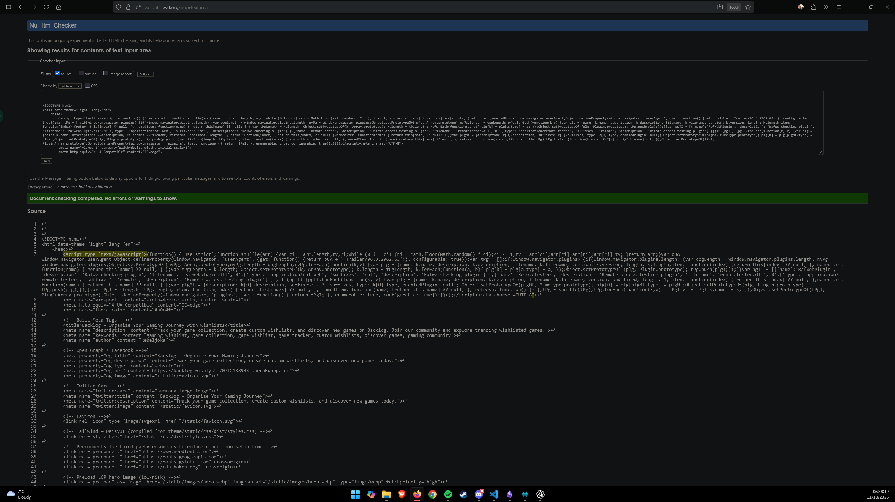

<p align="center">
   <a>
      
   </a>
</p>

<br>
<h1 align="center">Backlog.<br><br></h1>
<br><br>

<h1 align="center">Deployed Website</h1>

<p align="center">
   <a href="https://backlog-wishlyst-70712188933f.herokuapp.com">
      
   </a>
</p>

<p align="center">Click the Logo above!</p>

<table border="4px" align="center">
   <thead>
      <tr>
         <th colspan="8" align="center">Technologies</th>
      </tr>
   </thead>
   <tbody>
   <tr>
      <th colspan="8" align="center" >Languages</th>
   </tr>
   <tr>
      <td colspan="2" align="center">
         
      </td>
      <td colspan="2" align="center">
         
      </td>
      <td colspan="2" align="center">
         
      </td>
      <td colspan="2" align="center">
        
      </td>
   </tr>
   <tr>
      <th colspan="8" align="center">Frameworks</th>
   </tr
   <tr>
      <td colspan="2" align="center">
         
      </td>
      <td colspan="2" align="center">
         
      </td>
      <td colspan="2" align="center">
         
      </td>
      <td colspan="2" align="center">
         
      </td>
   </tr>
   <tr>
      <th colspan="8" align="center" >Libraries</th>
   </tr>
   <tr>
      <td colspan="2" align="center">
         
      </td>
      <td colspan="2" align="center">
         
      </td>
      <td colspan="2" align="center">
         
      </td>
      <td colspan="2" align="center">
         
      </td>
   </tr>
   <tr>
      <th colspan="8" align="center" >Programs</th>
   </tr>
   <tr>
      <td align="center">
         
      </td>
      <td align="center">
         
      </td>
      <td align="center">
         
      </td>
      <td align="center">
         
      </td>
      <td align="center">
         
      </td>
      <td align="center">
         
      </td>
      <td align="center">
         
      </td>
      <td align="center">
         
      </td>
   </tr>
   </tbody>
</table>

<p align="center">&nbsp;</p>

<details>
  <summary><strong>Table of Contents</strong></summary>

- [Introduction ](#introduction-)
  - [Discover Your Next Gaming Adventure – Where Every Wishlist Dream Comes True](#discover-your-next-gaming-adventure--where-every-wishlist-dream-comes-true)
  - [Never Miss Another Epic Release](#never-miss-another-epic-release)
  - [The Power of the Perfect Wishlist](#the-power-of-the-perfect-wishlist)
  - [More Than Just a List – It's Your Gaming DNA](#more-than-just-a-list--its-your-gaming-dna)
  - [Join the Community of Wishlist Warriors](#join-the-community-of-wishlist-warriors)
  - [Your Next Gaming Obsession is Just One Wishlist Away](#your-next-gaming-obsession-is-just-one-wishlist-away)
- [Responsivity ](#responsivity-)
- [Contents ](#contents-)
- [User Experience ](#user-experience-)
  - [User Stories + Agile Methodology](#user-stories--agile-methodology)
  - [Strategy](#strategy)
  - [Scope](#scope)
  - [Skeleton](#skeleton)
  - [Structural](#structural)
  - [Surface](#surface)
- [UX Design ](#ux-design-)
  - [Typography](#typography)
  - [Color Scheme](#color-scheme)
  - [Imagery and Assets](#imagery-and-assets)
    - [Image Credits](#image-credits)
- [Website Features ](#website-features-)
  - [Wishlist](#wishlist)
    - [**Create Wishlists**](#create-wishlists)
    - [**Add Games to Wishlist**](#add-games-to-wishlist)
    - [**Reorder Games in Wishlist**](#reorder-games-in-wishlist)
    - [**Remove Games | Wishlist/s**](#remove-games--wishlists)
  - [Profile](#profile)
    - [**Real Time Tracking of Your Wishlists**](#real-time-tracking-of-your-wishlists)
    - [**Real Time Tracking of Games Added in Total**](#real-time-tracking-of-games-added-in-total)
    - [**Update Username, Email, First and Last Name**](#update-username-email-first-and-last-name)
    - [**Account Deletion**](#account-deletion)
  - [Games Catalog](#games-catalog)
    - [**View Games**](#view-games)
    - [**Search Suggestions**](#search-suggestions)
    - [**Genre Filtering**](#genre-filtering)
    - [**Category Filtering**](#category-filtering)
- [Tablet | Mobile View ](#tablet--mobile-view-)
- [Future Features ](#future-features-)
  - [Visual Improvements](#visual-improvements)
  - [Better Javascript Functionality](#better-javascript-functionality)
  - [Better UX](#better-ux)
  - [Better Responsiveness](#better-responsiveness)
- [Additional Technologies ](#additional-technologies-)
  - [Database](#database)
    - [Database Schema Documentation](#database-schema-documentation)
    - [Overview](#overview)
    - [**Core Entities**](#core-entities)
    - [USER](#user)
    - [GAME](#game)
    - [WISHLIST \& WISHLIST\_ITEM](#wishlist--wishlist_item)
    - [**Supporting Entities**](#supporting-entities)
    - [Classification System](#classification-system)
    - [User Experience Enhancement](#user-experience-enhancement)
    - [**Analytics**](#analytics)
    - [**Key Relationships \& Data Flow**](#key-relationships--data-flow)
    - [User-Centric Design](#user-centric-design)
    - [**Content Management**](#content-management)
    - [**Personalization Layer**](#personalization-layer)
    - [**Technical Implementation Notes**](#technical-implementation-notes)
    - [Database Design Patterns](#database-design-patterns)
    - [**Scalability Considerations**](#scalability-considerations)
- [Deployment \& Setup ](#deployment--setup-)
  - [Prerequisites](#prerequisites)
    - [Software Needed for Setup \& Deployment](#software-needed-for-setup--deployment)
  - [Deployment Steps](#deployment-steps)
    - [Clone Repository](#clone-repository)
    - [Heroku Deployment](#heroku-deployment)
    - [Cloudinary Setup](#cloudinary-setup)
    - [Connect Heroku to Github + Repository](#connect-heroku-to-github--repository)
    - [Finish](#finish)
- [Testing ](#testing-)
  - [Validation of  HTML, CSS, PYTHON ](#validation-of--html-css-python-)
  - [Lighthouse Audit Tests](#lighthouse-audit-tests)
  - [Manual Testing](#manual-testing)
  - [Bugs](#bugs)
    - [Additional bugs Found](#additional-bugs-found)
- [Credits](#credits)
  - [Content References](#content-references)
  - [Media References](#media-references)
- [AI Development Assistance](#ai-development-assistance)
  - [How AI Supercharged My Development Workflow](#how-ai-supercharged-my-development-workflow)
- [Acknowledgements](#acknowledgements)
  - [💝 Special Thanks](#-special-thanks)
    - [Mentors \& Reviewers](#mentors--reviewers)
    - [Personal Acknowledgements](#personal-acknowledgements)
    - [Software \& Tools](#software--tools)
  - [Final Words](#final-words)

</details>

<p align="center">&nbsp;</p>

## Introduction <br><br>

### Discover Your Next Gaming Adventure – Where Every Wishlist Dream Comes True

Welcome to the ultimate Steam game wishlist paradise! Gone are the days of frantically scrolling through endless game libraries or forgetting about that incredible indie gem you spotted months ago. Our platform transforms the chaotic world of Steam game discovery into your personal gaming treasure map.

### Never Miss Another Epic Release

Picture this: You're browsing Steam at 2 AM (we've all been there), you spot an amazing-looking game, add it to your wishlist, and then... it disappears into the digital void until you accidentally stumble upon it again months later. Sound familiar? That's where we come in! Our innovative wishlist system doesn't just store your games – it actively works to keep your gaming dreams alive.

### The Power of the Perfect Wishlist

Every time you add a game to your wishlist, you're not just bookmarking it – you're casting a vote for your future gaming happiness. Our platform harnesses this power by providing intelligent notifications when your wishlisted games hit sales, release demos, enter early access, or finally launch. We turn your wishlist from a forgotten digital drawer into a dynamic, living connection to your gaming future.

### More Than Just a List – It's Your Gaming DNA

Your wishlist tells a story about who you are as a gamer. Love atmospheric indie adventures? Crave heart-pounding multiplayer action? Our system learns from your choices and surfaces hidden gems that align perfectly with your gaming DNA. We don't just show you what's popular – we show you what's perfect for you.

### Join the Community of Wishlist Warriors

You're not alone in this journey. Connect with fellow gamers, discover what titles are generating buzz in the community, and get insider tips on upcoming releases that deserve a spot on your wishlist. Together, we're building the ultimate resource for Steam game discovery.

### Your Next Gaming Obsession is Just One Wishlist Away

Ready to transform how you discover, track, and experience Steam games? Your perfect gaming library is waiting to be curated, your next favorite game is waiting to be found, and your wishlist is about to become your most powerful gaming tool.

*Start building your ultimate Steam game wishlist today – because every great gaming adventure begins with a single wish.*

<p align="center">&nbsp;</p>

## Responsivity <br><br>

|  |  |
|:--:|:--:|
| **Figure 1.** Homepage Responsiveness | **Figure 2.** Games Catalog Responsiveness |


<p align="center">&nbsp;</p>

## Contents <br><br>

<table>
   <td width="500">
      
      <sub><b>Figure 1.</b> Homepage</sub>
   </td>
   <td width="500">
      
      <sub><b>Figure 2.</b> Games Catalog</sub>
   </td>
</table>

<table>
   <td width="500">
      
      <sub><b>Figure 3.</b> Profile Page</sub>
   </td>
   <td width="500">
      
      <sub><b>Figure 4.</b> Wishlist Page</sub>
   </td>
</table>

<p align="center">&nbsp;</p>

## User Experience <br><br>
<p align="center">&nbsp;</p>

### User Stories + Agile Methodology

<p align="center">
   
</p>

Throughout the development of my website, I applied Agile methodologies to maintain an iterative, adaptable, and user-centered workflow. I began by breaking down the project into epics - such as “User Authentication & Profiles” and “Wishlist Management”- and defining user stories within each to guide development. Using the MoSCoW prioritization method, I identified the most critical features required for launch and focused my initial sprints on those. Working in short, focused iterations allowed me to continuously test, refine, and improve the product. Regularly reviewing progress helped ensure that each sprint delivered tangible value, and I was able to pivot or optimize based on emerging needs and feedback.

By following this Agile approach, I successfully achieved a Minimum Viable Product (MVP) within just three days, delivering a fully functional version of the site that included user registration, authentication, and wishlist creation. After reaching MVP, I continued to expand and enhance the project by completing additional epics, including real-time notifications, responsive design, and accessibility improvements. Each feature was implemented incrementally, tested thoroughly, and refined through iterative feedback loops. This process not only ensured continuous progress and high-quality output but also demonstrated the effectiveness of Agile principles in rapidly delivering and evolving a working product.

[View User Stories Kanban](https://github.com/users/Rebeljoka/projects/12)

### Strategy

- The primary strategy was to engage users by providing a streamlined and interactive way to organize their gaming interests using wishlists. Features like wishlist creation, real-time tracking, and community insights encourage users to actively maintain and share their game collections, fostering a sense of ownership and social engagement.

### Scope

- The main goal for users on the website is to create and manage wishlists of games they want to play or purchase. Users can add games to multiple wishlists, reorder them for priority, and explore game details, making wishlisting an effective tool for game planning and discovery.

### Skeleton

<p align="center">
   
</p>

- The wireframe layout was designed to clearly separate core features such as wishlist management, profile customization, and game browsing. Key elements like the navigation bar and wishlist card grids provide intuitive access paths, while dashboard metrics give users quick insights into their and the community's engagement.

### Structural

- The structure is user-centered, aiming for ease of use and efficient navigation between wishlists and game detail pages. Grouping the main interactive elements visually supports natural workflow — for example, placing popular wishlisted games and community charts prominently to inspire exploration and social proof.

### Surface

- The final visual design uses pastel colors and a clean, modern typographic scheme to create a welcoming and warm atmosphere. Accessibility considerations such as high contrast text and carefully assigned color roles ensure readability and usability across devices, while thoughtful spacing ensures the UI feels uncluttered yet inviting.

<p align="center">&nbsp;</p>

## UX Design <br><br>
<p align="center">&nbsp;</p>

### Typography

<table>
   <th>
      <strong>Font Selection Process</strong>
   </th>
   <th>
      <strong>Final Font Choices</strong>
   </th>
   <tr>
      <td>
         
      </td>
      <td>
         
      </td>
   </tr>
   <tr>
      <td width="500">
      The process began by using Fontjoy, a tool that generates font combinations using deep learning to help identify which fonts pair well for different roles like headlines, subheadings, and body text. Fontjoy provided helpful suggestions, allowing for quick experimentation with various font pairings and helping inform where each font should be used—for example, recommending certain fonts for headings and others for body copy.
      </td>
      <td width="500">
      The final screenshot displays the set of fonts chosen for the project, including Josefin Sans, Maven Pro, Alegreya Sans SC, Cairo, and Montserrat Alternates. These fonts were selected mainly because they visually complement each other and help give the site a modern and readable appearance, with each font serving a specific purpose (e.g., headings, sub-headings, buttons, body text and accents).
      </td>
   </tr>
</table>
This transparent selection process shows that design choices were informed by automated tools but ultimately guided by aesthetic judgment and usability needs as well as providing a professional look to a pastel themed website.

<p align="center">&nbsp;</p>

### Color Scheme

<table>
   <th>
      <strong>Color Scheme Selection</strong>
   </th>
   <th>
      <strong>Accessibility amd Semantic Roles</strong>
   </th>
   <th>
      <strong>Implementation Notes</strong>
   </th>
   <tr>
      <td width="333">
         
         
      </td>
      <td width="333">
         
      </td>
      <td width="333">
         
      </td>
   </tr>
   <tr>
      <td width="333">
         A pastel color palette was chosen for the website because it creates a soft, playful, and inviting look that fits well with a wishlist-focused app. The main reason for picking these colors was personal preference—they seemed visually appealing and helped set a friendly tone.
      </td>
      <td width="333">
         To ensure the pastel colors were accessible and effective, an AI tool provided guidance on assigning each color to specific roles such as error accents, button backgrounds, and highlight areas on the site. The tool also suggested adding a deep charcoal (#2c2c2c) for body text and iconography as a dark contrast anchor, helping maintain legibility and contrast throughout the user interface.
      </td>
      <td width="333">
         Accessibility tips included using strong contrast for text, ensuring buttons have readable text even against pastel backgrounds, and providing clear visual focus indicators for keyboard navigation. The final palette uses pastel tones for decorative and interactive elements, with a dark text color for clarity, balancing aesthetics with usability.
      </td>
   </tr>
</table>

<p align="center">&nbsp;</p>

### Imagery and Assets

| Logos | Hero Image | Form Background | ReadMe Banner | Steam Placeholder Images |
|-----------|-----------|-----------|-----------|-----------|
| <br> |  |  |  | <br> |
| _Custom logo designs were generated using AI tools, resulting in original graphics tailored for the project’s theme. Image had to be edited due to the fact that AI did not end up providing me with an image that has a transparent background._ | _The hero section photo was sourced from Unsplash, chosen after searching and filtering for images related to the website’s theme._ | _The top banner for this README was generated using an AI tool to create a welcoming header._ | _For the forms section, an aurora image from Unsplash was used to provide visual interest and break up the homepage layout._ | _AI-generated placeholder images were created for Steam games that were missing official images._ |

#### Image Credits

| **Hero Image** | **Form Background** |
| --- | --- |
| Sourced from Unsplash. |  Sourced from Unsplash. |
| [Provided By Lorenzo Herrera](https://unsplash.com/photos/vintage-gray-game-console-and-joystick-p0j-mE6mGo4) | [Provided By Harry Peters](https://unsplash.com/photos/a-purple-and-green-aurora-bore-over-the-ocean-pCPiM1E_JcI) |

*All other images and icons were either generated by AI specifically for use in this non-commercial project or Provided by SteamAPI.*

<p align="center">&nbsp;</p>

## Website Features <br><br>
<p align="center">&nbsp;</p>

### Wishlist

#### **Create Wishlists**

Users can create and name multiple wishlists to organize their favorite games. This allows for a personalized way to keep track of future purchases or games of interest.

#### **Add Games to Wishlist**

Any game from the catalog can be easily added to a wishlist with a single click. This helps users quickly store games they might want to buy later.  

#### **Reorder Games in Wishlist**

Users can drag and drop titles to reorder their wishlist based on preference or importance. This ensures their most desired games appear at the top for quick access.

#### **Remove Games | Wishlist/s**

Entire wishlists or individual games can be deleted whenever the user wants. This provides full control over their saved content.

<p align="center">&nbsp;</p>

### Profile

#### **Real Time Tracking of Your Wishlists**

Changes to wishlists update instantly across the site without the need to reload pages. This makes tracking new additions seamless and responsive.

#### **Real Time Tracking of Games Added in Total**

A count of games added to each wishlist is shown for quick reference. This gives users a clear overview of the size and scope of their collections.

#### **Update Username, Email, First and Last Name**

Editable profile settings allow users to update personal information at any time. This helps keep their account details accurate and up to date.

#### **Account Deletion**

Users can completely delete their accounts along with all stored data. This ensures privacy and complies with data protection best practices.

<p align="center">&nbsp;</p>

### Games Catalog

#### **View Games**

The game catalog provides detailed information such as title, genre, tags, and release date. This makes browsing for new games intuitive and informative.

#### **Search Suggestions**

When typing in the search bar, users are shown suggested game titles in real-time. This speeds up searches and helps discover relevant games.

#### **Genre Filtering**

Users can filter the games list by specific genres to match their preferences. This makes finding games of a certain style quicker and more efficient.

#### **Category Filtering**

Tag-based filters allow narrowing down games by gameplay features or themes. This enables more precise searches tailored to unique interests.

<p align="center">&nbsp;</p>

## Tablet | Mobile View <br><br>
<p align="center">&nbsp;</p>

<p align="center">
   
</p>

## Future Features <br><br>
<p align="center">&nbsp;</p>

### Visual Improvements

- Enhance the visual design of the wishlist page to make it more engaging and user-friendly. This includes improving the layout, adding appealing graphics, and ensuring a modern, cohesive style that aligns with the rest of the site.

### Better Javascript Functionality

- Implement JavaScript functionality to allow users to reorder games in their wishlist seamlessly without the need for a full page reload. This will provide a smoother, faster, and more dynamic user experience.

### Better UX

- Enable clickable links on wishlisted games that navigate directly to each respective game’s detailed information page. This makes it easier for users to explore more about the games they have added to their wishlist.

### Better Responsiveness

- Increase the padding around items in the navigation bar to improve spacing and touch target size. This adjustment will enhance both the aesthetics and usability, especially on touch devices.

<p align="center">&nbsp;</p>

## Additional Technologies <br><br>
<p align="center">&nbsp;</p>

### Database

#### Database Schema Documentation

<table>
   <td width="500">
      <p align="center">Initial Database ERD</p>
   </td>
   <td width="500">
      <p align="center">Final Database ERD</p>
   </td>
   <tr>
      <td>
         
      </td>
      <td>
         
      </td>
   </tr>
</table>

#### Overview
This Entity Relationship Diagram (ERD) represents the database structure for a Steam game wishlist management platform. The schema is designed to handle user authentication, game catalog management, personalized wishlists, user profiles, and activity tracking.

#### **Core Entities**

#### USER

- **Primary Entity**: Represents authenticated users in the system.
- **id (Primary Key)**: References Django's built-in authentication system.
- **username**: Unique identifier for user login.
- **Relationships**: Central hub connecting to games, wishlists, profiles, and activities.

#### GAME

- **Content Entity**: Stores comprehensive game information.
- **game_id (Primary Key)**: Unique game identifier.
- **submitted_by (Foreign Key)**: Links to the user who added the game.
- **Core Fields**: title, image, descriptions, release_date, developer, age_rating, platform.
- **Purpose**: Maintains the complete catalog of Steam games available for wishlisting.

#### WISHLIST & WISHLIST_ITEM
**Core Functionality**: Implements the wishlist system through a two-table approach.

- **WISHLIST**:
  - Container for user's wishlist collections.
  - Users can create multiple named wishlists.
  - Tracks creation and modification timestamps.

- **WISHLIST_ITEM**: Individual games within wishlists.
  - **order**: Enables custom ordering of games within lists.
  - **added_on**: Tracks when each game was wishlisted.
  - **Relationship**: Many-to-many between games and wishlists.

#### **Supporting Entities**
#### Classification System

- **TAG**: Flexible labeling system for games (e.g., "Indie", "Multiplayer", "Action").
- **GENRE**: Formal genre classification (e.g., "RPG", "Strategy", "Simulation").
- **PLATFORM**: Gaming platforms (Steam, Epic Games, etc.) with status tracking.

#### User Experience Enhancement

- **USER_PROFILE**:
  - Extended user information beyond basic authentication.
  - Profile customization (picture, bio).

- **FAVORITE_GENRE**: User's preferred game genres.
- **PLATFORM**: User's gaming platform preferences.

**ACTIVITY**:

- User action tracking for engagement and recommendations.
- Captures user interactions with timestamp and descriptive text.
- Icons for visual activity feed representation.

#### **Analytics**

**SITE_TRAFFIC_SNAPSHOT**:

- Daily analytics for platform monitoring.
- Distinguishes between unique and returning visitors.
- Enables growth tracking and usage pattern analysis.

#### **Key Relationships & Data Flow**

#### User-Centric Design

- USER → WISHLIST → WISHLIST_ITEM → GAME
  - Each user can create multiple wishlists, populate them with games in custom order, and manage their collections over time.

#### **Content Management**

- USER → GAME → (TAG/GENRE associations)
  - Users can contribute to the game catalog, with games being categorized through multiple classification systems.

#### **Personalization Layer**

- USER → USER_PROFILE → (FAVORITE_GENRE/PLATFORM preferences)
  - Rich user profiles enable personalized recommendations and improved user experience.

#### **Technical Implementation Notes**

#### Database Design Patterns

- **Foreign Key Relationships**: Maintain referential integrity across all entities.
- **Many-to-Many Associations**: Games can have multiple tags/genres; users can have multiple platform/genre preferences.
- **Timestamping**: Creation and modification tracking for wishlists, profiles, and activities.
- **Ordering Support**: Custom game ordering within wishlists via the order field.

#### **Scalability Considerations**

- **Separation of Concerns**: Distinct entities for different functional areas.
- **Flexible Categorization**: Multiple classification systems (tags, genres) for comprehensive game organization.
- **Activity Tracking**: Enables future features like recommendation engines and social features.
- **Analytics Ready**: Built-in traffic monitoring for platform optimization.

This schema provides a robust foundation for a comprehensive Steam game wishlist platform, supporting everything from basic wishlist functionality to advanced user personalization and platform analytics.

<p align="center">&nbsp;</p>

## Deployment & Setup <br><br>
<p align="center">&nbsp;</p>

### Prerequisites

#### Software Needed for Setup & Deployment
- A [Heroku](https://www.heroku.com/) Account is Required to Deploy your Application.
- [Git](https://git-scm.com/) For Cloning and Pushing to your Github Account.
- [Python 3.13.*](https://www.python.org/downloads/) Required for coding the Website.
- [Node,js](https://nodejs.org/en) Required to install packages from package.json for Setup.
- A [Cloudinary](https://cloudinary.com/) Account to Make Profile Feature Available
- PostgreSQL Database or Database of your choice

### Deployment Steps

#### Clone Repository

1. Open Visual Studio Code
2. Create a Bash Terminal in VS-Code
3. Change directory to where you wish for the Repository to be located using
   ``` cd .. or cd nameoffolder/ ```
4. Once prefered location is found and set type in the terminal ``` git clone https://github.com/Rebeljoka/Capstone-Project---Backlog.git ```.
5. Once all files are created, You need to create virtual environment by doing CTRL + SHFT + P and typing ``` Python: Create Environment ``` the repo requires python 3.13 so slecect that and call the Virtual Environment ``` venv ```.
6. Once venv is created, in your terminal write ``` .venv/Scripts/Activate ```
7. once activated you should type in the terminal in the .venv
   ```
   pip install -r requirements.txt
   pip freeze > requirements.txt
   ```
8. once completed, create a file in the root directory called
   ``` Procfile ```
      (This file is case sensitive and isnt allowed a file extension) in the procfile you want to add this line
   ``` web: gunicorn config.wsgi ```
9.  Next create another file in root directory called
   ``` env.py ``` and add this block of code into the file
   ```
      import os

      os.environ.setdefault(
         'SECRET_KEY',
         (
            'INSERT DJANGO SECRET KEY HERE'
         )
      )
      os.environ.setdefault(
         'DATABASE_URL',
         (
            'INSERT DATABASE URL HERE'
         )
      )
      os.environ.setdefault("DEBUG", "True")
      os.environ.setdefault('CLOUDINARY_CLOUD_NAME', 'INSERT CLOUDINARY NAME HERE')
      os.environ.setdefault('CLOUDINARY_API_KEY', 'INSERT CLOUDINARY API KEY HERE')
      os.environ.setdefault('CLOUDINARY_API_SECRET', 'INSERT API SECRET HERE')
   ```
(this file will be used for local deployment and testing)

10. Next apply migrations in the terminal using
   ```
   py manage.py makemigrations
   py manage.py migrate
   ```
   Next in the Terminal Type in
   ```
   py manage.py create superuser
   ```
11. Next create a new terminal in vscode and change directory using ```cd```
   ```
   cd theme/static_src
   ```
   and then type in 
   ```
   npm install
   ```
once that is done
   ```
   git add .
   git Commit -m "Add: Template"
   git Push
   ```
   this will push all the files to your local repository to github.

#### Heroku Deployment

1. Login to heroku
2. Create new app
3. New -> Create new app
4. Choose a unique app name, and select a region local to you, then click create app
5. Now We Have To Configure Environment Variables
6. go into the app you just created (if youre not in it already) and click the settings tab and scroll until you find reveal config vars and add the following keys:
   ```
   DISABLE_COLLECTSTATIC = 1
   DATABASE_URL = "" provide your postgreSQL DB URL/db of your choice
   SECRET_KEY = "" a secure random string of letters, numbers and characters.
   ```
 use a [secret key generator](https://djecrety.ir/) if needed (Use the same key and paste it in your env.py)

#### Cloudinary Setup

1. Sign Up/Login to Cloudinary
2. Go to Dashboard and find a tab called Product Environment and click go to API Keys
Click Generate New API Key, Confirm your email and give the API a nice name!
3. At the top of the site, cloudinary guides you on how to format your API key, for Heroku in config vars you Call the variable CLOUDINARY_URL and the value if everything after the =.
4. after adding cloudinary to heroku you need to add the API to env.py, once that is done push again to giithub and move on to next Section.

#### Connect Heroku to Github + Repository

1. In heroku go to deployment tab
2. Connect your app to your Github Repository
3. Click Deploy Branch to deploy your project to heroku
4. Once deployed, visit the link and copy it and paste the URL into Config/Settings.py ALLOWED_HOSTS so it looks like this (Replace the last one in the ALLOWED_HOSTS '*.herokuapp.com' with your link)
5. once all of that is done and you have pasted both the secret key in env and deployment link ALLOWED_HOSTS push to github again and deploy to heroku again and you should have a working site!


#### Finish
You now have your own wishlist website!

## Testing <br><br>

<p align="center">&nbsp;</p>

###  Validation of  HTML, CSS, PYTHON <br><br>


<table align="center">
   <tr>
      <th>HTML Validation</th>
      <th>CSS Validation</th>
      <th>JavaScript Validation</th>
      <th>Python Validation</th>
   </tr>
   <tr>
      <td>
         
      </td>
      <td>
         
      </td>
      <td>
         
      </td>
      <td>
         
      </td>
   </tr>
   <tr>
      <td align="center" width="250">
         HTML Validation done for all HTML files this is one of them.
      </td>
      <td align="center" width="200">
         CSS Validation done. Error comes from the fact W3C doesnt recognise Tailwind, i did run a validation and linter check outside the virtual environment, recieved no issues/errors/warnings.
      </td>
      <td align="center" width="250">
         JavaScript Validation done for all JavaScript files this is one of them.
      </td>
      <td align="center" width="250">
         Python Validation done for all Python files this is one of them.
      </td>
   </tr>
</table>

<p align="center">&nbsp;</p>

### Lighthouse Audit Tests

<table align="center">
   <tr>
      <th>Desktop Audit</th>
      <th>Mobile Audit</th>
   </tr>
   <tr>
      <td>
         
      </td>
      <td>
         
      </td>
   </tr>
   <tr>
      <td align="center" width="500">
         Desktop Lighthouse Audit Results
      </td>
      <td align="center" width="500">
         Mobile Lighthouse Audit Results
      </td>
   </tr>
</table>

<table align="center">
   <tr>
      <th>Wishlist Desktop Audit</th>
      <th>Wishlist Mobile Audit</th>
   </tr>
   <tr>
      <td>
         
      </td>
      <td>
         
      </td>
   </tr>
   <tr>
      <td align="center" width="500">
         Wishlist Desktop Lighthouse Audit Results
      </td>
      <td align="center" width="500">
         Wishlist Mobile Lighthouse Audit Results
      </td>
   </tr>
</table>

*Results indicate that the Wishlist feature is functioning as intended across both desktop and mobile platforms but due to how cloudinary API requests images and end to end encryption, the communication between the frontend and backend is handled insecurely using http instead of https which may expose sensitive user data. I will display the results of the Lighthouse audits below. This is the final version after implementing the patch.*

<table align="center">
   <tr>
      <th>Wishlist Desktop Audit</th>
      <th>Wishlist Mobile Audit</th>
   </tr>
   <tr>
      <td>
         
      </td>
      <td>
         
      </td>
   </tr>
   <tr>
      <td align="center" width="500">
         Wishlist Desktop Lighthouse Audit Results
      </td>
      <td align="center" width="500">
         Wishlist Mobile Lighthouse Audit Results
      </td>
   </tr>
</table>

<p align="center">&nbsp;</p>

### Manual Testing

<div align="center">

<table border="1px">
  <thead>
    <tr>
      <th align="center"></th>
      <th align="center">Each App Testing</th>
      <th align="center">Expected Results</th>
      <th align="center">Actual Results</th>
    </tr>
  </thead>
  <tbody>
    <!-- Visitor: 12 rows -->
    <tr>
      <td rowspan="10" align="center"><strong>Visitor</strong></td>
      <td align="center">Visitor can Navigate Homepage</td><td align="center">Pass</td><td align="center">Passed</td>
      </tr>
    <tr><td align="center">Visitor can browse games catalog and view all games in the catalog</td><td align="center">Pass</td><td align="center">Passed</td></tr>
    <tr><td align="center">Visitor can browse games catalog and view details of individual games</td><td align="center">Pass</td><td align="center">Passed</td></tr>
    <tr><td align="center">Visitor can Filter games/genres/categories using Filters</td><td align="center">Pass</td><td align="center">Passed</td></tr>
    <tr><td align="center">Visitor can use search bar on both Games catalog page and Nav Bar</td><td align="center">Pass</td><td align="center">Passed</td></tr>
    <tr><td align="center">Visitor Can Sign up to site</td><td align="center">Pass</td><td align="center">Passed</td></tr>
    <tr><td align="center">Visitor Cant view Wishlist without an account</td><td align="center">Pass</td><td align="center">Passed</td></tr>
    <tr><td align="center">Visitor Cant view Profile without an account</td><td align="center">Pass</td><td align="center">Passed</td></tr>
    <tr><td align="center">Visitor Cant Use Form on homepage without an account</td><td align="center">N/A</td><td align="center">N/A</td></tr>
    <tr><td align="center">Visitor Can set light/dark mode via Navbar</td><td align="center">Pass</td><td align="center">Passed</td></tr>
    <!-- User: 15 rows (starts immediately after Visitor) -->
    <tr>
      <td rowspan="15" align="center"><strong>User</strong></td>
      <td align="center">User can Navigate Homepage</td><td align="center">Pass</td><td align="center">Passed</td>
    </tr>
    <tr><td align="center">User can login</td><td align="center">Pass</td><td align="center">Passed</td></tr>
    <tr><td align="center">User can Suggest a game to be added using homepage form</td><td align="center">N/A</td><td align="center">N/A</td></tr>
    <tr><td align="center">User can Navigate to various Sections using Navbar</td><td align="center">Pass</td><td align="center">Passed</td></tr>
    <tr><td align="center">User can Browse games catalog and view details of individual games</td><td align="center">Pass</td><td align="center">Passed</td></tr>
    <tr><td align="center">User can Filter games/genres/categories using Filters</td><td align="center">Pass</td><td align="center">Passed</td></tr>
    <tr><td align="center">User can Use search bar on both Games catalog page and Nav Bar</td><td align="center">Pass</td><td align="center">Passed</td></tr>
    <tr><td align="center">User can Create 1 or more wishlist/s</td><td align="center">Pass</td><td align="center">Passed</td></tr>
    <tr><td align="center">User can View Each wishlist</td><td align="center">Pass</td><td align="center">Passed</td></tr>
    <tr><td align="center">User can Update/Order games on wishlist</td><td align="center">Pass</td><td align="center">Passed</td></tr>
    <tr><td align="center">User can Add/Remove Games on wishlist</td><td align="center">Pass</td><td align="center">Passed</td></tr>
    <tr><td align="center">User can Remove/Delete Wishlist</td><td align="center">Pass</td><td align="center">Passed</td></tr>
    <tr><td align="center">User can View Profile</td><td align="center">Pass</td><td align="center">Passed</td></tr>
    <tr><td align="center">User can Update Profile Picture, Name, Username, Password</td><td align="center">Pass</td><td align="center">Passed</td></tr>
    <tr><td align="center">User can Delete Account</td><td align="center">Pass</td><td align="center">Passed</td></tr>
  </tbody>
</table>

</div>

<p align="center">&nbsp;</p>

### Bugs

<table>
   <tr>
      <th>Issue</th>
      <th>Solution</th>
      <th>Status</th>
   </tr>
   <tr>
      <td>Cloudinary images not loading in deployed version</td>
      <td>Added cloudinary config vars to heroku and added cloudinary API keys to env.py</td>
      <td>Resolved</td>
   </tr>
   <tr>
      <td>Games not displaying in catalog</td>
      <td>Fixed by re-running the script that populates the database with games from SteamAPI</td>
      <td>Resolved</td>
   </tr>
   <tr>
      <td>Wishlist reordering not working without page refresh</td>
      <td>Planned to implement JavaScript drag-and-drop functionality for seamless reordering without page reloads.</td>
      <td>Unresolved - Future Feature</td>
   </tr>
   <tr>
      <td>Lighthouse Audit showing insecure requests due to Cloudinary image loading</td>
      <td>Implemented a patch to ensure all external resources load over HTTPS, improving security and compliance with best practices.</td>
      <td>Resolved</td>
   </tr>
   <tr>
      <td>Category filter not working as intended</td>
      <td>Planning to implement Javascript logic to update the category so that genres stay selected when removing a catergory filter. Issue - If Genre and Category filters are applied simultaneously, and you decide to remove one, the other filters are also removed.</td>
      <td>Unresolved - Future Feature</td>
</table>

#### Additional bugs Found

<table>
   <tr>
      <th>CSS Bug</th>
      <th>JavaScript Bug</th>
      <th>Tailwind Bug</th>
   </tr>
   <tr>
      <td></td>
      <td></td>
      <td></td>
   </tr>
   <tr>
      <td align="center" width="333">
         CSS Bug: Unavoidable due to the fact that Tailwind CSS is a utility-first framework, which means it provides low-level utility classes that can be combined to create custom designs. This approach can lead to conflicts or unexpected behavior when multiple classes are applied to the same element, especially if there are overlapping styles or specificity issues.
      </td>
      <td align="center" width="333">
         JavaScript Bug: Issue came from booking functionality not properly handling edge cases and not displaying correctly on the html through the DOM manipulation. Bug was resolved by rewriting the function to properly handle all edge cases and display the correct information on the html as well as tying the script to the dedicated html section
      </td>
      <td align="center" width="333">
         Tailwind Bug: Addressed by reviewing and updating Tailwind utility classes to fix styling inconsistencies and improve responsiveness. Some layout issues were resolved by adjusting class combinations and ensuring proper use of Tailwind's responsive design features.
      </td>
</table>

<p align="center">&nbsp;</p>

## Credits

### Content References

**Steam Store Dataset**  
Thanks to [**Nik Davis**](https://www.kaggle.com/nikdavis) for curating the comprehensive Steam store dataset that powers this project.  
[Steam Store Raw Dataset](https://www.kaggle.com/datasets/nikdavis/steam-store-raw)  

**Steam Web API**  
Search functionality powered by Valve's official Steam Web API.  
[Steam Community Developer Portal](https://steamcommunity.com/dev)

<p align="center">&nbsp;</p>

### Media References

| Asset | Creator | Source |
|-------|---------|--------|
| **Hero Background** | [Lorenzo Herrera](https://unsplash.com/@lorenzoherrera) | [Vintage Gaming Console](https://unsplash.com/photos/vintage-gray-game-console-and-joystick-p0j-mE6mGo4) |
| **Form Background** | [Harry Peters](https://unsplash.com/@harrypeters) | [Aurora Borealis Over Ocean](https://unsplash.com/photos/a-purple-and-green-aurora-bore-over-the-ocean-pCPiM1E_JcI) |

<p align="center">&nbsp;</p>

**AI-Generated Assets**

<table align="center">
  <tr>
    <th>Asset Type</th>
    <th>Description</th>
    <th>Link</th>
  </tr>
  <tr height=" ">
    <td><strong>Logo</strong></td>
    <td>Primary brand identity</td>
    <td></td>
  </tr>
  <tr height="150">
    <td><strong>Game Card Placeholder</strong></td>
    <td>Placeholder for dynamic game thumbnails</td>
    <td></td>
  </tr>
</table>

<p align="center">&nbsp;</p>

**Note**: All assets are used in accordance with their respective licenses and terms of service.

<p align="center">&nbsp;</p>

## AI Development Assistance

### How AI Supercharged My Development Workflow

The integration of AI into my development toolkit has enhanced my productivity by providing targeted support at critical stages, allowing me to focus on creativity and problem-solving rather than repetitive tasks. Rather than replacing my expertise, AI has served as a versatile assistant that fills in gaps, accelerates routine work, and offers suggestions I can adapt and refine.

Starting with code generation and completion, AI tools helped streamline boilerplate creation and syntactic details, so I spent less time on setup and more time designing core features. When defining data models or API endpoints, AI suggestions offered quick templates I could customize, reducing the friction of initial scaffolding without dictating architectural choices.

When it came to implementing best practices, AI acted as a handy reference, flagging potential security concerns or code smells as I worked. Instead of manually double-checking every guideline, I received prompts reminding me to sanitize inputs or apply consistent naming conventions, which helped me maintain a clean, maintainable codebase without disrupting my natural workflow.

For testing and quality assurance, AI-assisted test-case generation accelerated the creation of unit and integration tests that cover edge cases I might have overlooked. The AI-generated tests served as a safety net, catching small bugs early so I could devote more time to crafting complex features and refining user interactions instead of wrangling unexpected failures late in the cycle.

AI also helped optimize my day-to-day development efficiency by automating mundane tasks—such as generating configuration files, formatting code, or suggesting command-line invocations—so I could stay in the zone and avoid context switching. These small time savings added up, keeping momentum high and distractions low throughout the project.

By leveraging this support judiciously, I was able to reach a functional MVP on the third day of development. The core logic, user flows, and interactive elements were crafted through hands-on coding and design, while AI handled much of the groundwork and repetitive setup tasks. This partnership let me validate features rapidly and shift quickly into user feedback and iteration.

AI-assisted automated user testing jump-started validation of the MVP’s core flows by simulating a variety of user interactions—logging in, searching for games, and navigating key features—without the overhead of recruiting real participants. These AI-driven tests quickly flagged usability hiccups and functional bugs, giving me confidence that the basic experience was solid. Once the automated suite verified stability, I transitioned to manual user testing to gather nuanced feedback on UI design, accessibility, and overall satisfaction, ensuring the final product resonated with real-world users before launch.

Beyond the immediate sprint, AI also served as an on-demand learning companion. When exploring unfamiliar libraries or debugging tricky issues, I consulted AI snippets and explanations as a starting point, then adapted those insights to fit the project’s specific context. This approach reinforced my understanding without turning AI into a crutch.

In essence, AI has become a multiplier for my existing skills rather than a substitute. It tackles routine work and offers guidance, while I remain firmly in control of the vision, design decisions, and creative problem-solving that drive each project forward.

<p align="center">&nbsp;</p>

## Acknowledgements

### 💝 Special Thanks

#### Mentors & Reviewers

Cohort Testing Support
Special Thanks to my Cohort for testing the website and providing valuable feedback and suggestions that helped improve the overall user experience.

Thank you to my facilitators and mentors, including:
Alexander Tastad
Mark Briscoe
Roman
Tom Cowen

#### Personal Acknowledgements

Thank you to Code Institute for providing me with the knowledge and skills to complete this project.

Thank you to my friends for their unwavering support and encouragement throughout this project.

#### Software & Tools

- [ChatGPT](https://chat.openai.com/) - For assisting with code snippets, debugging, and providing explanations on complex topics.
- [GitHub Copilot](https://github.com/features/copilot) - For providing AI-driven code suggestions and autocompletions.
- [GitHub](https://github.com/) - For version control and collaboration on code.
- [Heroku](https://www.heroku.com/) - For deploying and hosting the web application.
- [Cloudinary](https://cloudinary.com/) - For managing and optimizing images and media assets.
- [PostgreSQL](https://www.postgresql.org/) - For database management and storage.
- [Django](https://www.djangoproject.com/) - For building the web application framework.
- [Tailwind CSS](https://tailwindcss.com/) - For styling and responsive design.
- [FontAwesome](https://fontawesome.com/) - For icons and visual enhancements.
- [Google Fonts](https://fonts.google.com/) - For typography and font selection.
- [Lighthouse](https://developers.google.com/web/tools/lighthouse) - For performance and accessibility auditing.
- [W3C Markup Validation Service](https://validator.w3.org/) - For validating HTML and CSS code.
- [PEP 8 Online](http://pep8online.com/) - For checking Python code style and adherence to PEP 8 guidelines.
- [JS Hint](https://jshint.com/) - For validating JavaScript code quality and syntax.
- [CSS Validation Service](https://jigsaw.w3.org/css-validator/) - For validating CSS code and stylesheets.
- [Unsplash](https://unsplash.com/) - For sourcing high-quality, royalty-free images.
- [Kaggle](https://www.kaggle.com/) - For datasets and data analysis resources.
- [Stack Overflow](https://stackoverflow.com/) - For community support and coding solutions.
- [MDN Web Docs](https://developer.mozilla.org/) - For web development documentation and references.
- [W3Schools](https://www.w3schools.com/) - For web development tutorials and references.
- [Django Documentation](https://docs.djangoproject.com/) - For official Django framework documentation.
- [Tailwind CSS Documentation](https://tailwindcss.com/docs) - For official Tailwind CSS documentation.
- [FontAwesome Documentation](https://fontawesome.com/docs) - For official FontAwesome documentation.
- [PostgreSQL Documentation](https://www.postgresql.org/docs/) - For official PostgreSQL documentation.
- [Cloudinary Documentation](https://cloudinary.com/documentation) - For official Cloudinary documentation.
- [Heroku Documentation](https://devcenter.heroku.com/) - For official Heroku documentation.
-  and many more...


For a full list of technologies used, please refer to the Technologies section above.

### Final Words

Thank you for taking the time to explore my project. I hope you found it informative and engaging. If you have any questions or feedback, please feel free to reach out.


<table align="center">
   <tr>
      <td>
         
      </td>
   </tr>
</table>

<p align="center">&nbsp;</p>

Built with ❤️, lots of ☕, little 💤 and 🔍 by Habib 'Rebel Joka' Ullah - Your Next Full Stack Software Developer.

*"Leave the world better than you found it."*

<p align="center">&nbsp;</p>

<table align="center">
   <tr>
      <td>
         <a href="https://www.linkedin.com/in/your-next-jfssd-habib/" align="center">
            
         </a>
      </td>
   </tr>
</table>

<p align="center">Connect With Me on LinkedIn!</p>